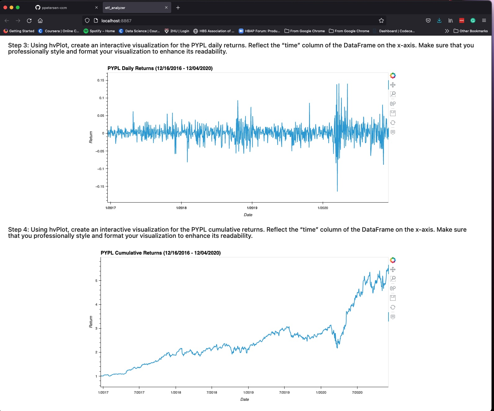
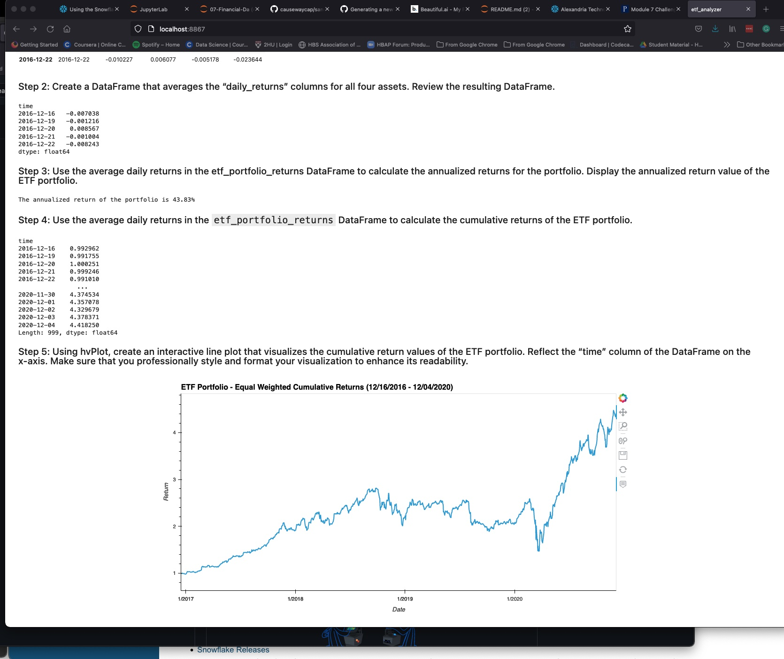

# *ETF Analyzer*                                  

### By: Pete Petersen  
        March 12, 2022  
---
**Welcome to the ETF Analyzer Project!**

This project primarily explores the use of SQL Alchemy.  We use SQL Alchemy to connect to a SQL Lite database named etf.db.  This database contains pricing data for 4 ETF from which construct an equally weighted portfolio and visualize returns.

# Background

In recent years, finance has had an explosion in passive investing. Passive investing means that you invest in a basket of assets that’s called an exchange-traded fund (ETF). This way, you don’t spend time researching individual stocks or companies or take the risk of investing in a single stock. ETFs offer more diversification.  See screen shots at the bottom of this readme for some example of the analyzer.


## Dependencies

To begin the project you must clone this repo and install the following dependincies:

```python

import numpy as np
import pandas as pd
import hvplot.pandas
import sqlalchemy

```

## Files
    etf.db
    etf_analyzer.ipynb

# Screen Images



